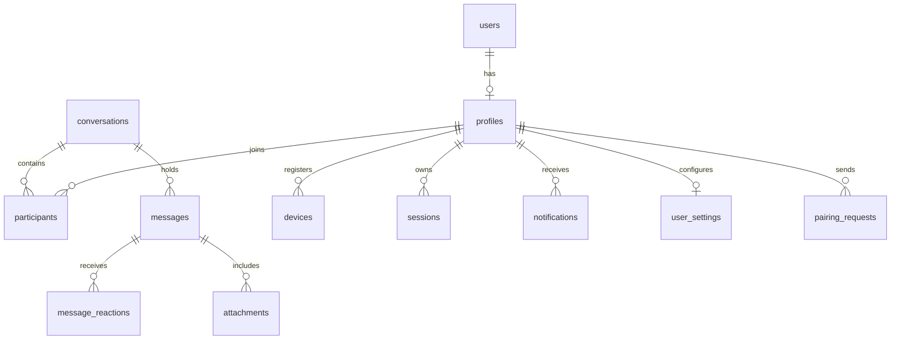

# Product Requirements Document (PRD)
## Project Name: Couple
### Version: 1.6.0
### Date: June 2026

---

## 1. Executive Summary

**Couple** is a private, secure, anonymous, and modern messaging platform designed exclusively for couples. Instead of copying bloated multi-user chat platforms, **Couple** is built on an exclusive one-to-one relationship model: **exactly one conversation between two verified partners in a secure digital room**.

The application focuses on three pillars:
1. **Absolute Privacy & Anonymity**: No emails, phone numbers, or real identities are collected. Authentication relies purely on Username + Password + a 16-word Recovery Phrase.
2. **Exclusive Relationship Lock**: Hard database constraints limit users to exactly one active relationship and conversation. Users cannot search, discover, or invite multiple people.
3. **Auto-Expiration**: To respect data ownership, accounts inactive for 90 consecutive days enter a deletion window and are permanently erased (zero-data footprint).
4. **Premium UX Focus (Material Design 3)**: Providing a fluid, responsive interface adhering strictly to custom Material Design 3 (Material You) styling guidelines and motion behaviors.

---

## 2. Product Philosophy & Relationship Lock

### 2.1 Core Business Rules
* **Strict 1-to-1 Model**: A user can only be connected to ONE partner.
* **Relationship Lock**: Once two users successfully connect and become a verified couple, both profiles are relationship-locked.
* **Zero Social Discovery**: No contact lists, public discovery, search engines, stories, broadcasts, channels, groups, or communities exist.

### 2.2 The Connection & Dissolution Lifecycles

#### Relationship Lock Activation
When Partner A and Partner B verify the connection code:
1. The database provisions a `conversations` record (representing the joint room) and sets `is_verified = true`.
2. Both participants' records are linked to the conversation ID.
3. Database indices prevent either user ID from joining any other participant row.

```
     [Partner A] (Unpaired)     [Partner B] (Unpaired)
              │                         │
              └───────────┬─────────────┘
                          │ (Generate/Verify Code)
                          ▼
            [Conversation / relationship_id]
                          │
              ┌───────────┴─────────────┐
              ▼                         ▼
      [Partner A] (Locked)      [Partner B] (Locked)
```

#### Dissolution Flow (Settings → Relationship → Disconnect Partner)
If a couple decides to separate:
1. **Double Confirmation**: Both users must tap and confirm "Disconnect Partner".
2. **24-Hour Cooling-Off Period**: The request enters a 24-hour transition state during which either user can cancel the separation.
3. **Message Retention Policy**: Message history remains intact unless **both** users request a complete wipe.
4. **Return to Unpaired State**: Once the cooling-off period completes, both profiles are unlinked, the conversation is deactivated, and either user is permitted to link with a new partner.

---

## 3. Scope of Couple V1

To ensure the core experience is flawless, V1 strictly prioritizes core communication.

### 3.1 V1 Scope
* **Anonymous Authentication**: Username + Password. 16-word Recovery Phrase generated on signup (stored locally/encrypted, hashed using Argon2id for recovery verification).
* **Partner Connection**: Generate Couple Code, Partner enters the code, establishes the relationship lock and Verified Couple badge status.
* **Core Messaging**: Real-time End-to-End Encrypted text and image messaging.
* **Chat Interactions**: Typing indicators, partner online/offline status, read receipts (ticks), message reactions, message replies, message editing, message deletion (soft/hard), and text search.
* **Couple Dissolution**: Dual-consent separation flow with 24-hour cooling-off state.
* **Security & Inactivity Policy**: Accounts inactive for 90 days enter a pending deletion state, fully erasing all data after 7 days of grace. Active sessions showing country + device name (no IP storage).
* **Settings**: Theme preferences, notifications, active session management, relationship disconnect actions, and account expiration countdown.

### 3.2 Excluded from V1 (Zero-Bloat Policy)
* ❌ Friends / Followers / Contact lists
* ❌ Public profiles & Username search / discovery
* ❌ Groups / Communities / Channels / Broadcasts
* ❌ Voice & Video calls
* ❌ Stories / Status feeds
* ❌ Shared notes, diaries, calendars, trackers, and stickers marketplace

---

## 4. User Stories

### Authentication, Verification & Lock
* **US-1**: As a user, I want to sign up anonymously using only a username and password, and receive a 16-word recovery phrase hashed with Argon2id for password resets.
* **US-2**: As a user, I want to connect with my partner using a unique Couple Code, locking both of our accounts to each other and preventing any other pairing.
* **US-3**: As a verified couple, I want to land directly inside our secure room (e.g., "Partner A ❤️ Partner B - Verified Couple") without navigating any contact or chat lists.
* **US-4**: As a separated user, I want to trigger a disconnect request requiring mutual approval and a 24-hour cooling-off period before we are unpaired.

---

## 5. Functional Requirements

### 5.1 Account Recovery & Security
* **Sign-Up Flow**: Username + Password creation, followed by a one-time 16-word seed generation.
* **Inactivity Auto-Deletion**: Accounts inactive for 90 days are flagged `pending_deletion`, then permanently erased after 7 grace days.

### 5.2 Single Conversation Architecture
* **Single Connection Constraint**: The application prohibits creating or listing multiple chats. Home is always the active single partner conversation.
* **Participant Limit**: Tables enforce a limit of exactly two participants per conversation.

---

## 6. Complete Database Design

The schema is built on PostgreSQL inside Supabase. 



### 6.1 Database Schema (SQL DDL)

```sql
-- Create custom enums
CREATE TYPE message_type AS ENUM ('text', 'image', 'system');
CREATE TYPE device_platform AS ENUM ('android', 'web', 'windows');
CREATE TYPE account_status AS ENUM ('active', 'pending_deletion');
CREATE TYPE dissolution_status AS ENUM ('none', 'pending', 'dissolved');

-- 1. Profiles Table (extends auth.users)
CREATE TABLE public.profiles (
    id UUID REFERENCES auth.users(id) ON DELETE CASCADE PRIMARY KEY,
    username VARCHAR(30) UNIQUE NOT NULL,
    display_name VARCHAR(50) NOT NULL,
    gender VARCHAR(15), 
    bio VARCHAR(200),   
    avatar_url TEXT,
    is_verified BOOLEAN DEFAULT false,
    online_status BOOLEAN DEFAULT false,
    status account_status DEFAULT 'active'::account_status NOT NULL,
    recovery_hash TEXT NOT NULL, -- Argon2id hash of the 16-word recovery phrase
    last_seen TIMESTAMP WITH TIME ZONE DEFAULT timezone('utc'::text, now()) NOT NULL,
    created_at TIMESTAMP WITH TIME ZONE DEFAULT timezone('utc'::text, now()) NOT NULL,
    updated_at TIMESTAMP WITH TIME ZONE DEFAULT timezone('utc'::text, now()) NOT NULL
);

-- 2. Conversations Table (strictly holds pair links)
CREATE TABLE public.conversations (
    id UUID DEFAULT gen_random_uuid() PRIMARY KEY,
    created_at TIMESTAMP WITH TIME ZONE DEFAULT timezone('utc'::text, now()) NOT NULL,
    encryption_epoch INT DEFAULT 1 NOT NULL,
    is_verified BOOLEAN DEFAULT false NOT NULL,
    dissolution_state dissolution_status DEFAULT 'none'::dissolution_status NOT NULL,
    dissolution_requested_at TIMESTAMP WITH TIME ZONE,
    dissolution_requested_by UUID REFERENCES public.profiles(id)
);

-- 3. Participants Table
CREATE TABLE public.participants (
    id UUID DEFAULT gen_random_uuid() PRIMARY KEY,
    conversation_id UUID REFERENCES public.conversations(id) ON DELETE CASCADE NOT NULL,
    profile_id UUID REFERENCES public.profiles(id) ON DELETE CASCADE NOT NULL,
    joined_at TIMESTAMP WITH TIME ZONE DEFAULT timezone('utc'::text, now()) NOT NULL,
    UNIQUE(conversation_id, profile_id)
);

-- STRICT RELATIONSHIP LOCK ENFORCEMENT: A user can join at most ONE active conversation row
CREATE UNIQUE INDEX unique_user_single_conversation ON public.participants(profile_id);

-- 4. Messages Table (E2EE payload encrypted on client side)
CREATE TABLE public.messages (
    id UUID DEFAULT gen_random_uuid() PRIMARY KEY,
    conversation_id UUID REFERENCES public.conversations(id) ON DELETE CASCADE NOT NULL,
    sender_id UUID REFERENCES public.profiles(id) ON DELETE SET NULL NOT NULL,
    encrypted_payload TEXT NOT NULL, 
    nonce TEXT NOT NULL,             
    msg_type message_type DEFAULT 'text'::message_type NOT NULL,
    sent_at TIMESTAMP WITH TIME ZONE DEFAULT timezone('utc'::text, now()) NOT NULL,
    delivered_at TIMESTAMP WITH TIME ZONE,
    read_at TIMESTAMP WITH TIME ZONE,
    is_edited BOOLEAN DEFAULT false NOT NULL,
    parent_message_id UUID REFERENCES public.messages(id) ON DELETE SET NULL
);

-- 5. Message Reactions Table
CREATE TABLE public.message_reactions (
    id UUID DEFAULT gen_random_uuid() PRIMARY KEY,
    message_id UUID REFERENCES public.messages(id) ON DELETE CASCADE NOT NULL,
    profile_id UUID REFERENCES public.profiles(id) ON DELETE CASCADE NOT NULL,
    reaction_emoji VARCHAR(10) NOT NULL,
    created_at TIMESTAMP WITH TIME ZONE DEFAULT timezone('utc'::text, now()) NOT NULL,
    UNIQUE(message_id, profile_id)
);

-- 6. Attachments Table
CREATE TABLE public.attachments (
    id UUID DEFAULT gen_random_uuid() PRIMARY KEY,
    message_id UUID REFERENCES public.messages(id) ON DELETE CASCADE NOT NULL,
    encrypted_url TEXT NOT NULL,         
    thumbnail_url TEXT,                 
    mime_type VARCHAR(50) NOT NULL,
    file_size INT NOT NULL,
    created_at TIMESTAMP WITH TIME ZONE DEFAULT timezone('utc'::text, now()) NOT NULL
);

-- 7. Devices Table
CREATE TABLE public.devices (
    id UUID DEFAULT gen_random_uuid() PRIMARY KEY,
    profile_id UUID REFERENCES public.profiles(id) ON DELETE CASCADE NOT NULL,
    device_token TEXT UNIQUE NOT NULL,
    platform device_platform NOT NULL,
    public_identity_key TEXT NOT NULL,  
    is_trusted BOOLEAN DEFAULT false NOT NULL,
    last_active TIMESTAMP WITH TIME ZONE DEFAULT timezone('utc'::text, now()) NOT NULL
);

-- 8. Sessions Table (No IP address stored to preserve privacy)
CREATE TABLE public.sessions (
    id UUID DEFAULT gen_random_uuid() PRIMARY KEY,
    profile_id UUID REFERENCES public.profiles(id) ON DELETE CASCADE NOT NULL,
    country VARCHAR(100),
    device_name VARCHAR(100) NOT NULL,
    user_agent TEXT NOT NULL,
    logged_in_at TIMESTAMP WITH TIME ZONE DEFAULT timezone('utc'::text, now()) NOT NULL,
    last_active TIMESTAMP WITH TIME ZONE DEFAULT timezone('utc'::text, now()) NOT NULL,
    token_version INT DEFAULT 1 NOT NULL
);

-- 9. Notifications Table
CREATE TABLE public.notifications (
    id UUID DEFAULT gen_random_uuid() PRIMARY KEY,
    recipient_id UUID REFERENCES public.profiles(id) ON DELETE CASCADE NOT NULL,
    title TEXT NOT NULL,
    body TEXT NOT NULL,
    is_read BOOLEAN DEFAULT false NOT NULL,
    created_at TIMESTAMP WITH TIME ZONE DEFAULT timezone('utc'::text, now()) NOT NULL
);

-- 10. User Settings Table
CREATE TABLE public.user_settings (
    profile_id UUID REFERENCES public.profiles(id) ON DELETE CASCADE PRIMARY KEY,
    theme_preference VARCHAR(15) DEFAULT 'system' NOT NULL,
    notifications_enabled BOOLEAN DEFAULT true NOT NULL,
    silent_mode_enabled BOOLEAN DEFAULT false NOT NULL,
    last_modified_at TIMESTAMP WITH TIME ZONE DEFAULT timezone('utc'::text, now()) NOT NULL
);

-- 11. Ephemeral Connection Codes Table
CREATE TABLE public.pairing_requests (
    id UUID DEFAULT gen_random_uuid() PRIMARY KEY,
    sender_id UUID REFERENCES public.profiles(id) ON DELETE CASCADE NOT NULL,
    connection_code VARCHAR(6) UNIQUE NOT NULL, 
    created_at TIMESTAMP WITH TIME ZONE DEFAULT timezone('utc'::text, now()) NOT NULL,
    expires_at TIMESTAMP WITH TIME ZONE NOT NULL
);
```

---

## 7. Design System & Material Design 3 (M3) Architecture

### 7.1 M3 Color Tokens & Theming (Material You Dynamic Palette)
* **Light Theme**:
  * Primary: `#c0005a` (Warm Rose Red)
  * On Primary: `#ffffff`
  * Primary Container: `#ffd9e2`
  * On Primary Container: `#40001a`
  * Background: `#fffbff` (Warm tint)
  * Surface: `#fffbff`
  * Surface Variant: `#f2dde1`
* **Dark Theme**:
  * Primary: `#ffb1c8` (Soft Rose Gold)
  * On Primary: `#66002d`
  * Primary Container: `#8d0043`
  * On Primary Container: `#ffd9e2`
  * Background: `#201a1b` (Deep warm dark burgundy)
  * Surface: `#201a1b`
  * Surface Variant: `#514346`

### 7.2 M3 Interactive Components & Interactions
* **Dynamic Theming (Material You)**: Theme colors dynamically adjust based on selected accents or system-level wallpaper colors.
* **M3 Navigation & Workspace Layout**: Single-screen canvas with rounded cards (`border-radius: 28px` for containers) and a floating action bar at the bottom.
* **M3 Chat Bubbles (Asymmetric Corners)**: Dynamic shape scaling where incoming messages have fully rounded edges (`20px`) with a sharp bottom-left corner (`4px`), and outgoing messages have a sharp bottom-right corner (`4px`).
* **Material Motion & Ripple**: Every touch element contains custom, fluid ink ripple effects (`MaterialRipple`) and spring-based interpolation animations (duration: 300ms, damping ratio: 0.8).
* **M3 Bottom Sheets & Menus**: Long-press on messages opens a modern M3 Bottom Sheet with haptic feedback, presenting reaction chips and contextual action lists.
* **Material Shared Axis Transitions**: Switching from active chat to settings morphs components fluidly along the Z-axis, preserving visual continuity.

---

## 8. Screen UX Specifications

### 8.1 Splash Screen
* Minimalist centering animation of the Couple logo. Checks authentication and routing status.

### 8.2 Login & Registration Screen
* **Register**: Input fields for Username and Password. Displays 16-word recovery phrase.
* **Login**: Simple username/password input. Includes a "Recover Account" option using the 16-word seed.

### 8.3 Partner Connection Screen (Direct Stepper)
* Option 1: "Generate Couple Code" (displays a 6-digit alphanumeric code).
* Option 2: "Enter Partner's Code" (text field for code verification).
* Shows **Partner A ❤️ Partner B Verified Couple** badge with a pulsing heart animation on completion.

### 8.4 Single Chat Workspace Screen
* Direct landing screen for verified couples. No chat lists or navigation bar. Uses the custom M3 layout.
* **Layout**: Shows partner display name, online/offline status, and "Verified Couple" status directly in the top header.

### 8.5 Settings Screen
* **Active Relationship**: Lists partner details, session metrics, auto-deletion countdown status.
* **Dissolution flow**: Tapping "Disconnect Partner" triggers the 24-hour cooling-off state indicator. Shows separation progress timer.

---

## 9. Security Architecture & Encryption
* **Standard**: Signal Protocol / double-ratchet implementation.
* **Key Setup**: Ephemeral X3DH keys published via the client device database entries.
* **Storage**: Encrypted Shared Preferences on Android, DPAPI on Windows, and memory-locked master-key encrypted IndexedDB on Web.
* **Account Recovery Security**: The 16-word recovery phrase is hashed with Argon2id on device using unique salts before transmission, or hashed by the server Edge function using Argon2id. Plaintext seed values never cross the network boundaries or touch database storage.
